# API de Consultas Veterinarias

## Ejecutar Migraciones de Base de Datos

Antes de realizar las consultas, asegúrate de ejecutar el siguiente comando para aplicar las migraciones:

dotnet ef database update --project ./Persistencia --startup-project ./Api

## Consultas de Endpoints

### 1. Veterinarios con Especialidad en Cirujano Vascular

**Endpoint:**

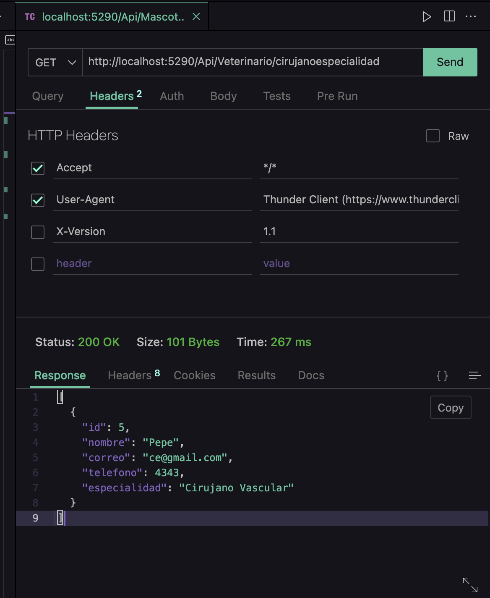

http://localhost:5290/Api/Veterinario/cirujanoespecialidad

### 2. Medicamentos del Laboratorio Genfar

**Endpoint:**

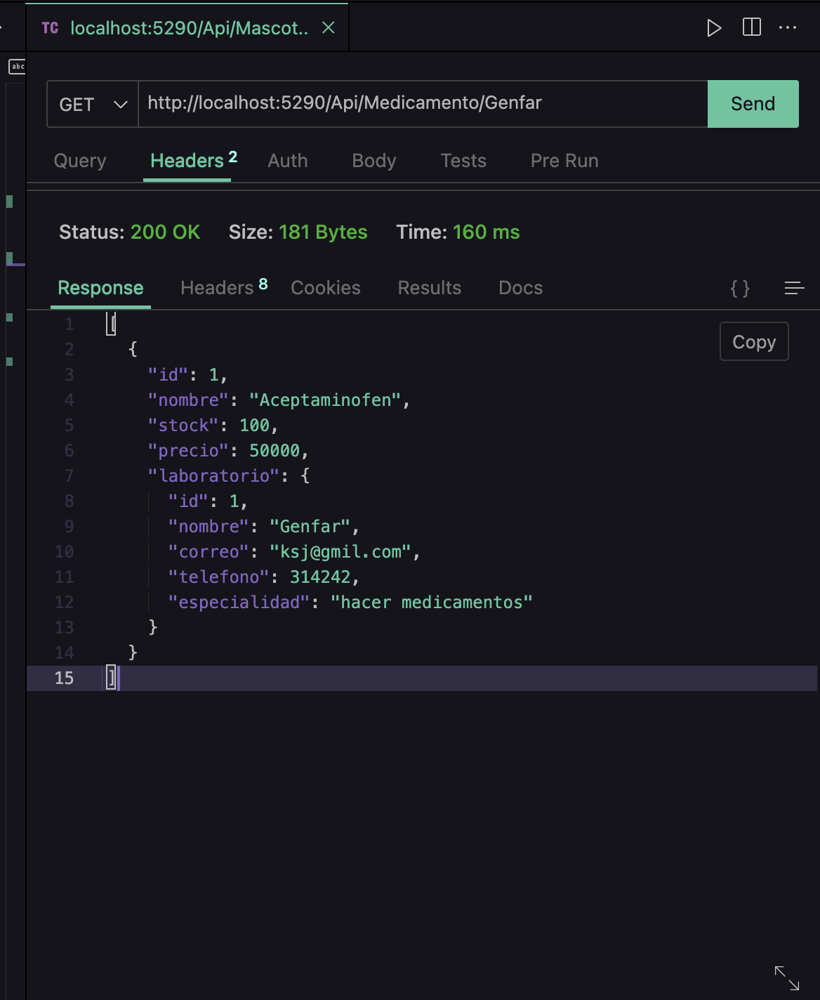
http://localhost:5290/Api/Medicamento/Genfar

### 3. Mascotas Registradas de Especie Felina

**Endpoint:**
 
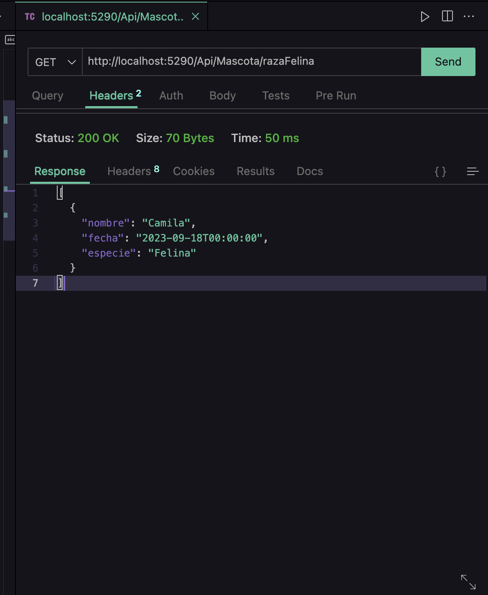

http://localhost:5290/Api/Mascota/razaFelina

### 4. Propietarios y Sus Mascotas

**Endpoint:**

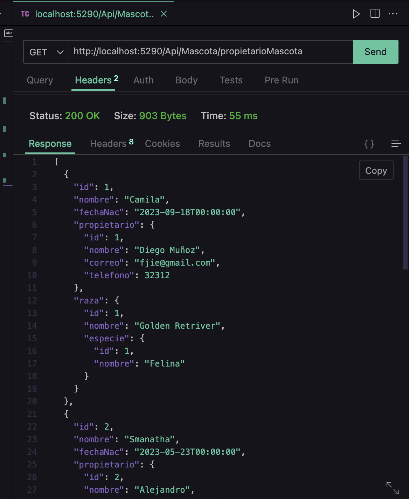
http://localhost:5290/Api/Mascota/propietarioMascota

### 5. Medicamentos con Precio de Venta Mayor a 50000

**Endpoint:**

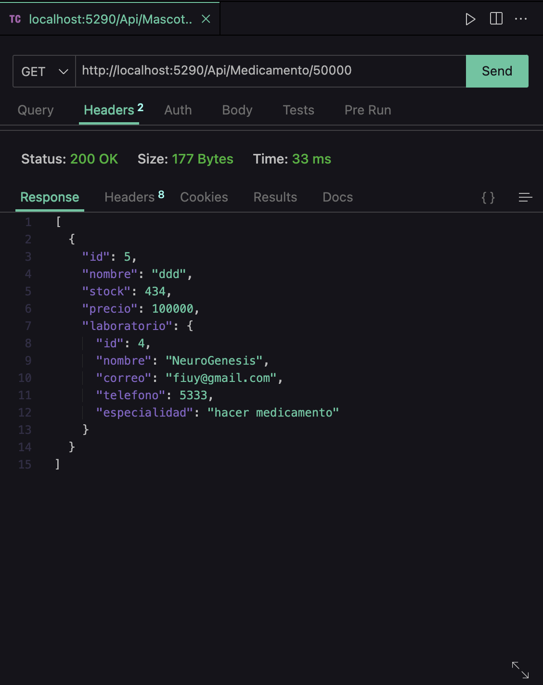

http://localhost:5290/Api/Medicamento/50000

### 6. Mascotas Atendidas por Motivo de Vacunación en el Primer Trimestre del 2023

**Endpoint:**
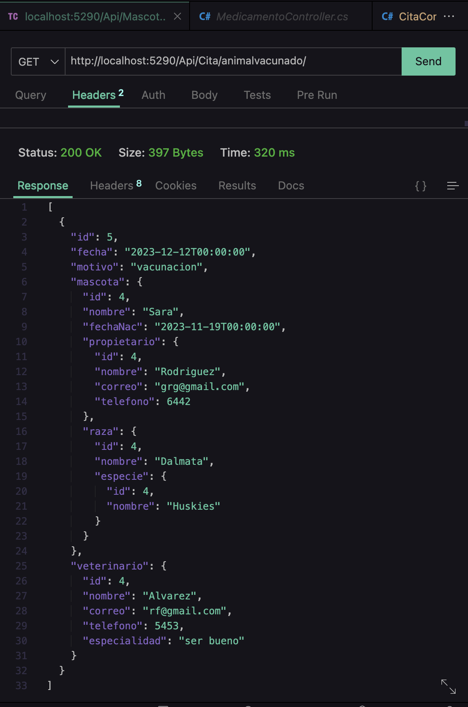

http://localhost:5290/Api/Cita/animalvacunado

### 7. Mascotas Agrupadas por Especie

**Endpoint:**
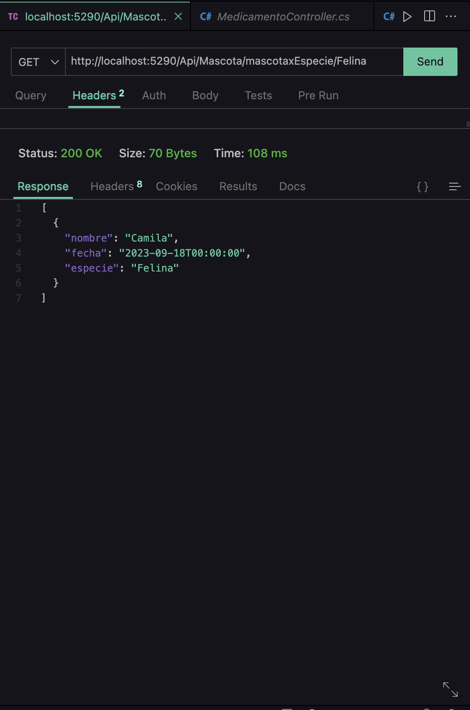
http://localhost:5290/Api/Mascota/mascotaxEspecie/Felina

### 8. Movimientos de Medicamentos y Valor Total

**Endpoint:**
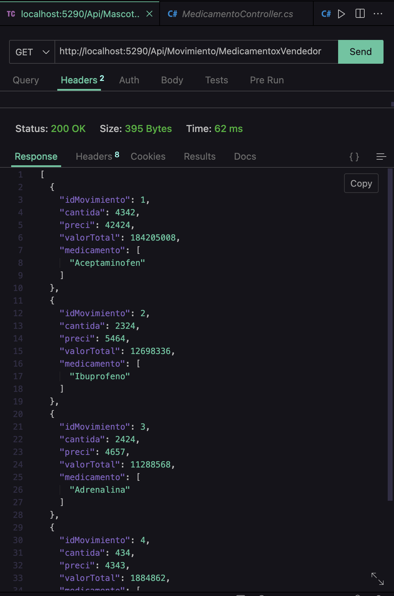

http://localhost:5290/Api/Movimiento/MedicamentoxVendedor

### 9. Mascotas Atendidas por un Veterinario Específico

**Endpoint:**
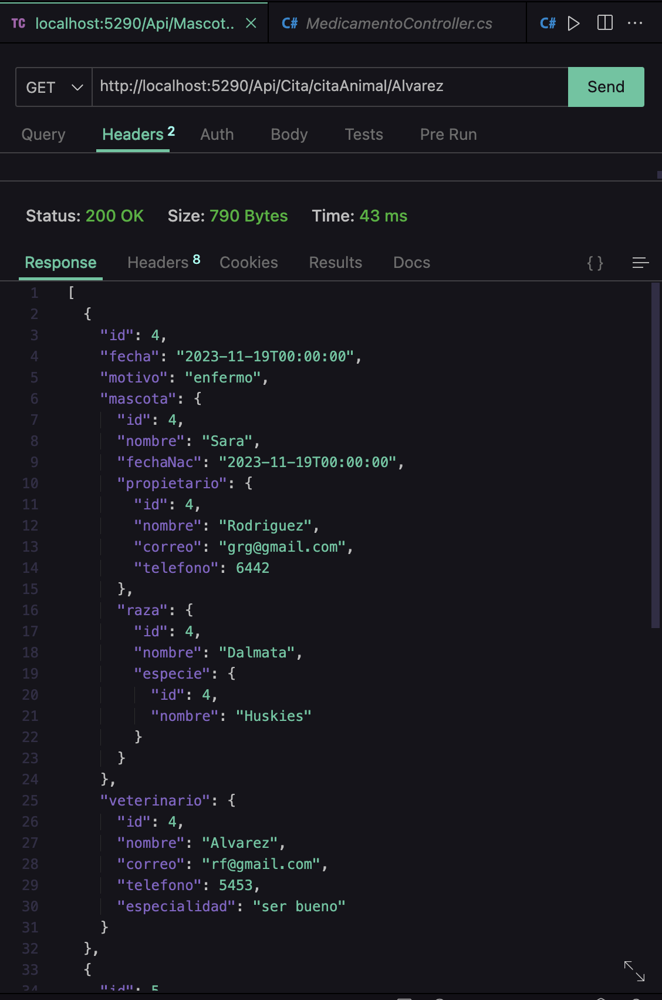
http://localhost:5290/Api/Cita/citaAnimal/Alvarez

### 10. Proveedores que Venden un Medicamento Específico

**Endpoint:**

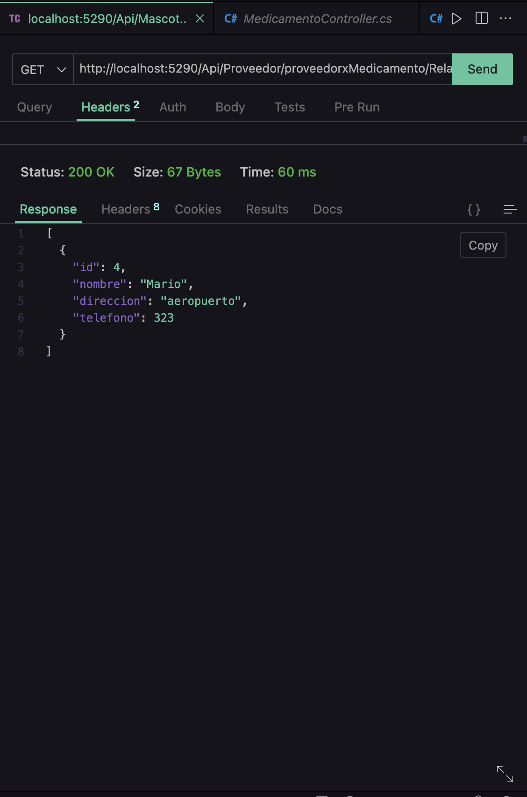
http://localhost:5290/Api/Proveedor/proveedorxMedicamento/Relajante

### 11. Mascotas y Propietarios de Raza Golden Retriever

**Endpoint:**
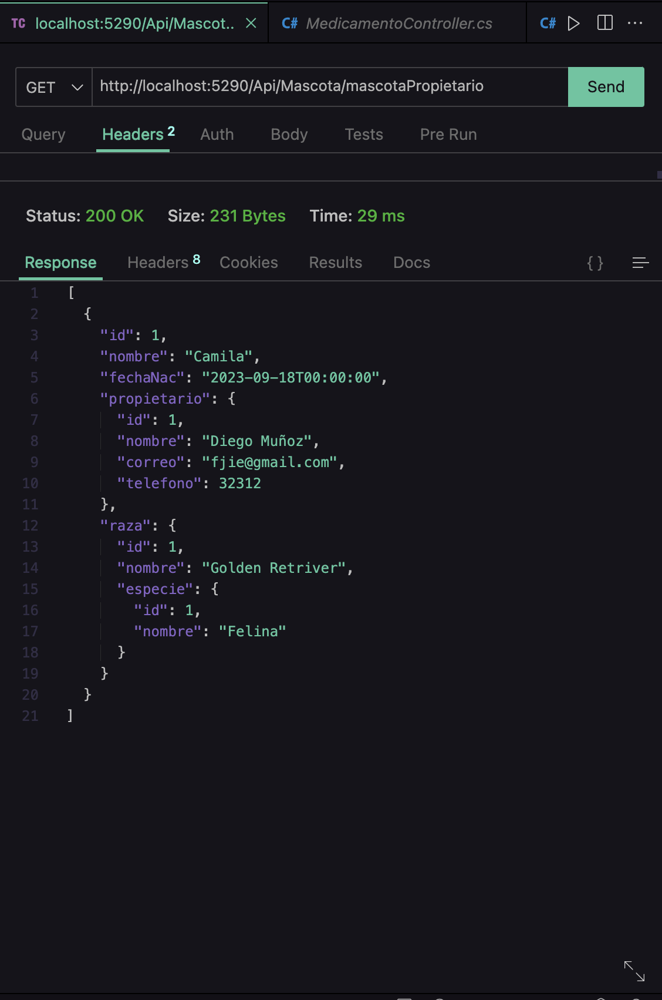
http://localhost:5290/Api/Mascota/mascotaPropietario

### 12. Cantidad de Mascotas por Raza

**Endpoint:**

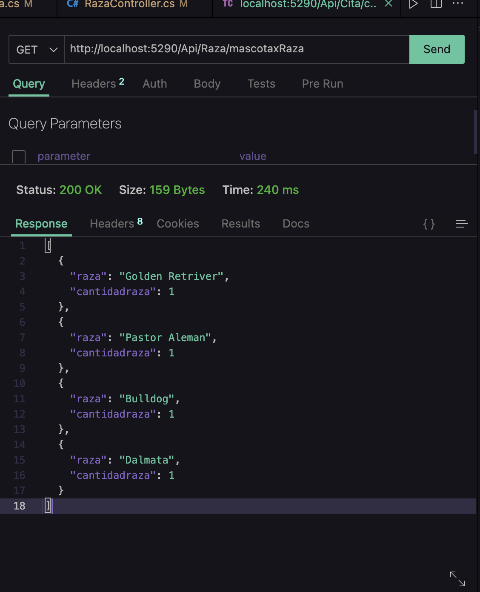
http://localhost:5290/Api/Raza/mascotaxRaza

