# Proyecto de API para Almacenamiento de Datos y Consultas Veterinarias

## Descripción General

Esta aplicación web, desarrollada en C# con .NET Core, implementa un sistema de gestión integral para clínicas veterinarias. La API facilita operaciones CRUD sobre diversas entidades relacionadas con la administración, como veterinarios, mascotas, medicamentos, propietarios, citas y más.

El objetivo principal es ofrecer una herramienta eficiente para gestionar los datos de la clínica veterinaria y realizar consultas específicas mediante endpoints bien estructurados.

## Características Principales

- **Gestión de Veterinarios**: Registro, consulta y organización por especialidades.
- **Control de Mascotas**: Registro de mascotas, agrupación por especies y vinculación con propietarios.
- **Administración de Medicamentos**: Inventario por laboratorio, precios y movimientos asociados.
- **Registro de Citas**: Seguimiento detallado de atenciones por motivos y periodos.
- **Consultas Específicas**: Búsquedas avanzadas, como mascotas por especie o propietarios de razas particulares.

## Requisitos Previos

1. **SDK de .NET Core**: Asegúrate de tener el SDK de .NET Core instalado en tu sistema.
2. **Base de Datos Configurada**: Este proyecto utiliza Entity Framework Core para la gestión de datos. Configura la conexión a tu base de datos en el archivo `appsettings.json`.

¡Con este proyecto, la gestión de tu clínica veterinaria será más eficiente y organizada!

## Ejecución de Migraciones

Antes de realizar consultas o pruebas, es necesario aplicar las migraciones de base de datos. Ejecuta el siguiente comando en la terminal:

**dotnet ef database update --project ./Persistencia --startup-project ./Api**

Este comando asegura que las tablas y relaciones necesarias estén correctamente configuradas en tu base de datos.

### Endpoints Disponibles

A continuación, se describen los endpoints más importantes disponibles en la API:

1. Veterinarios con Especialidad en Cirujano Vascular

URL: http://localhost:5290/Api/Veterinario/cirujanoespecialidad

Descripción: Devuelve una lista de veterinarios especializados en cirugía vascular.
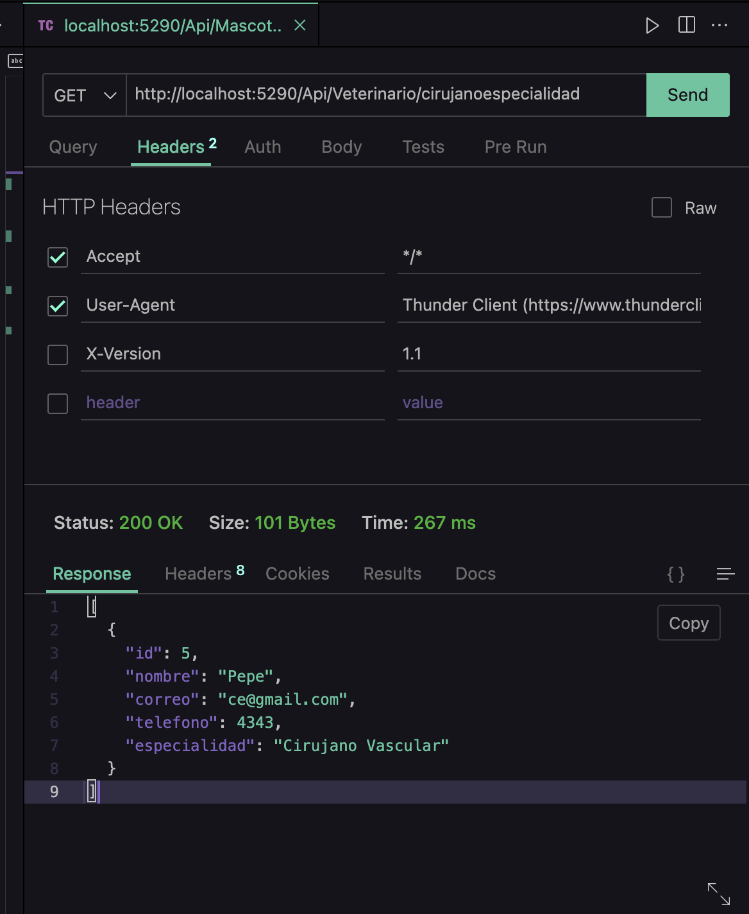

2. Medicamentos del Laboratorio Genfar

URL: http://localhost:5290/Api/Medicamento/Genfar

Descripción: Lista todos los medicamentos fabricados por el laboratorio Genfar.
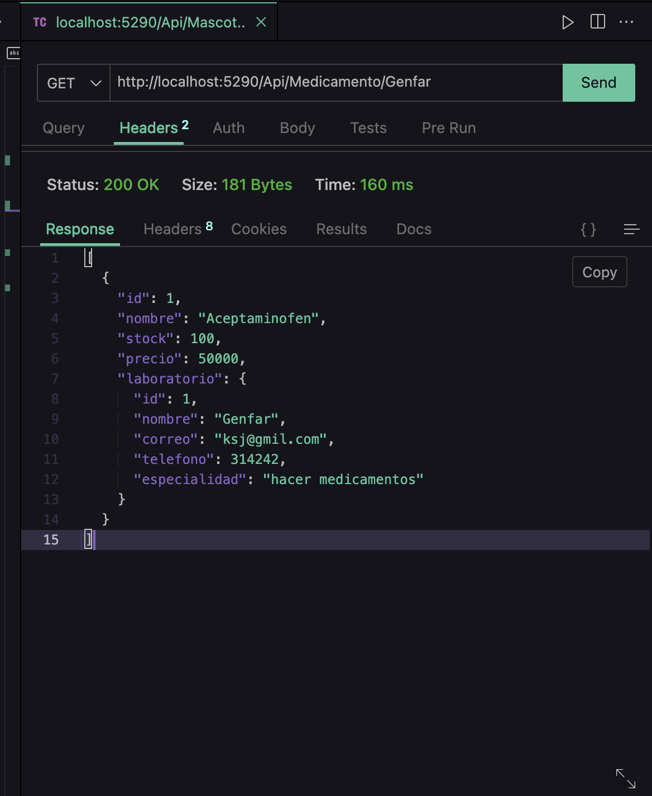

3. Mascotas Registradas de Especie Felina

URL: http://localhost:5290/Api/Mascota/razaFelina

Descripción: Devuelve una lista de todas las mascotas registradas de especie felina.
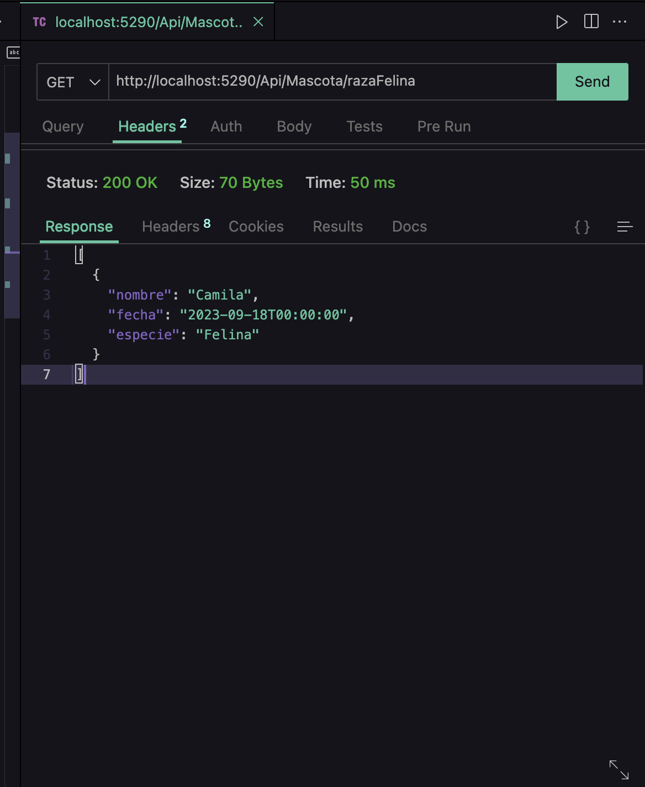

4. Propietarios y Sus Mascotas

URL: http://localhost:5290/Api/Mascota/propietarioMascota

Descripción: Proporciona información de los propietarios junto con sus respectivas mascotas.
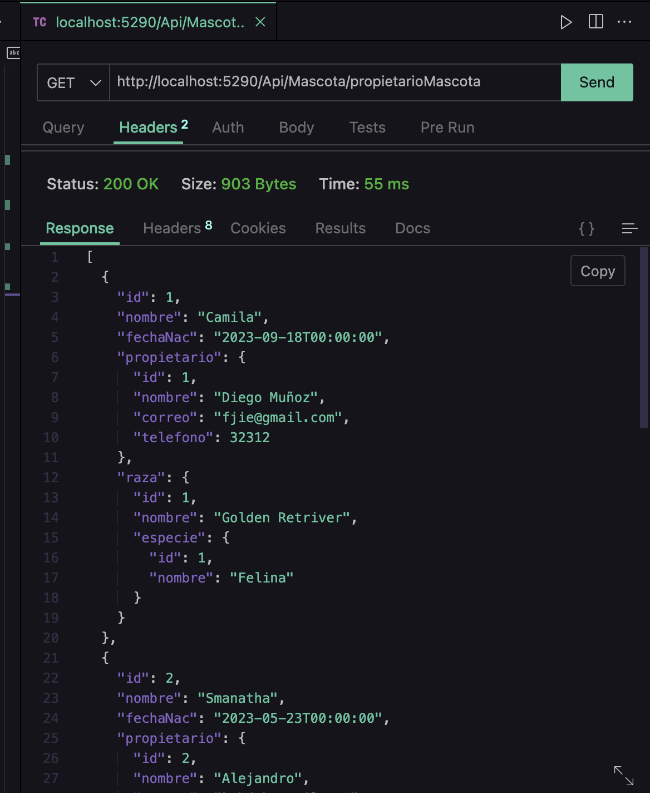

5. Medicamentos con Precio de Venta Mayor a 50,000

URL: http://localhost:5290/Api/Medicamento/50000

Descripción: Lista los medicamentos cuyo precio de venta supera los 50,000.
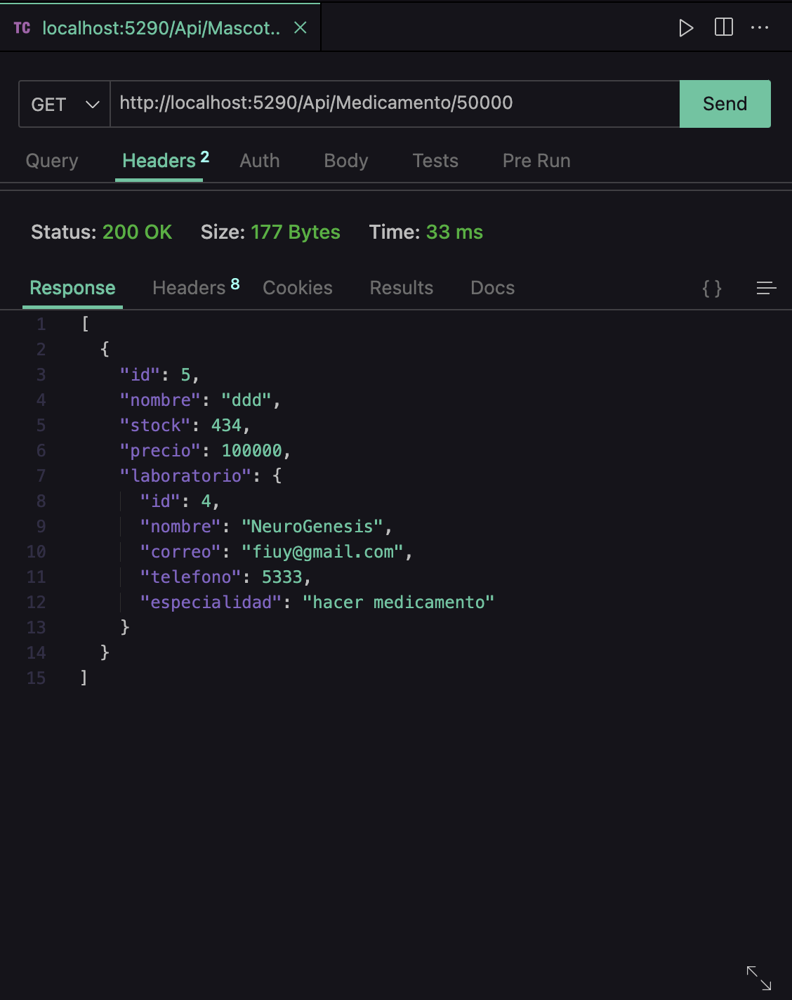

6. Mascotas Atendidas por Motivo de Vacunación en el Primer Trimestre del 2023

URL: http://localhost:5290/Api/Cita/animalvacunado

Descripción: Devuelve las mascotas vacunadas en el primer trimestre de 2023.
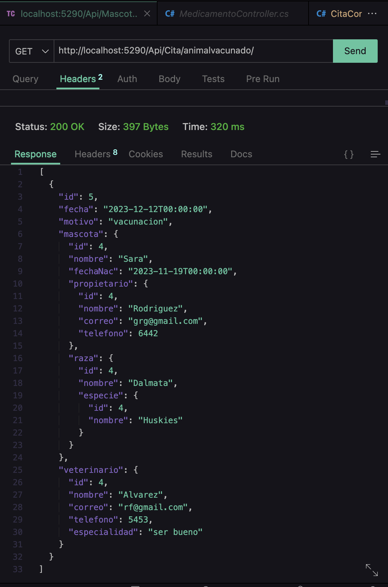

7. Mascotas Agrupadas por Especie

URL: http://localhost:5290/Api/Mascota/mascotaxEspecie/Felina

Descripción: Lista las mascotas agrupadas por especie, en este caso, felina.
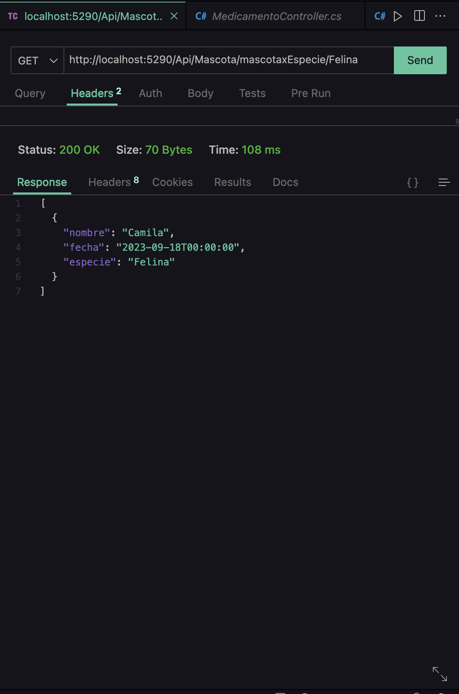

8. Movimientos de Medicamentos y Valor Total

URL: http://localhost:5290/Api/Movimiento/MedicamentoxVendedor

Descripción: Detalla los movimientos de medicamentos y calcula el valor total de estos.
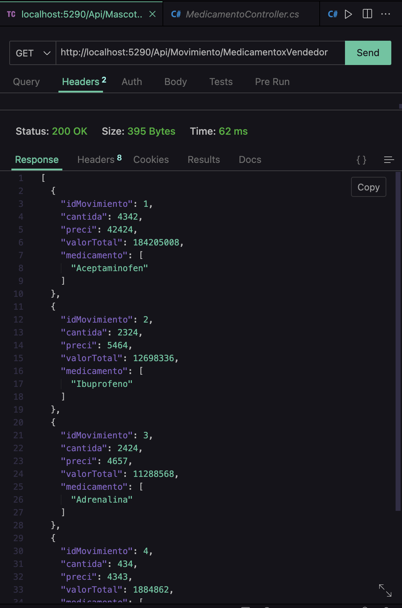

9. Mascotas Atendidas por un Veterinario Específico

URL: http://localhost:5290/Api/Cita/citaAnimal/Alvarez

Descripción: Devuelve las mascotas atendidas por un veterinario específico.
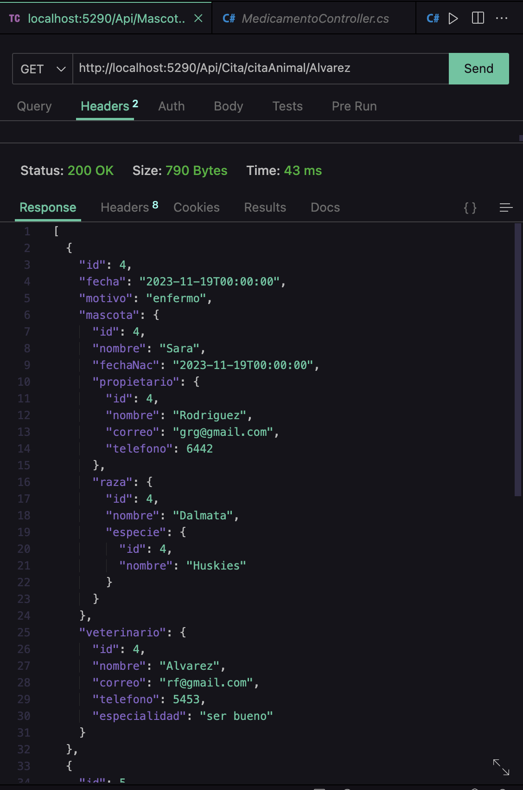

10. Proveedores que Venden un Medicamento Específico

URL: http://localhost:5290/Api/Proveedor/proveedorxMedicamento/Relajante

Descripción: Lista los proveedores que venden medicamentos específicos, como "Relajante".
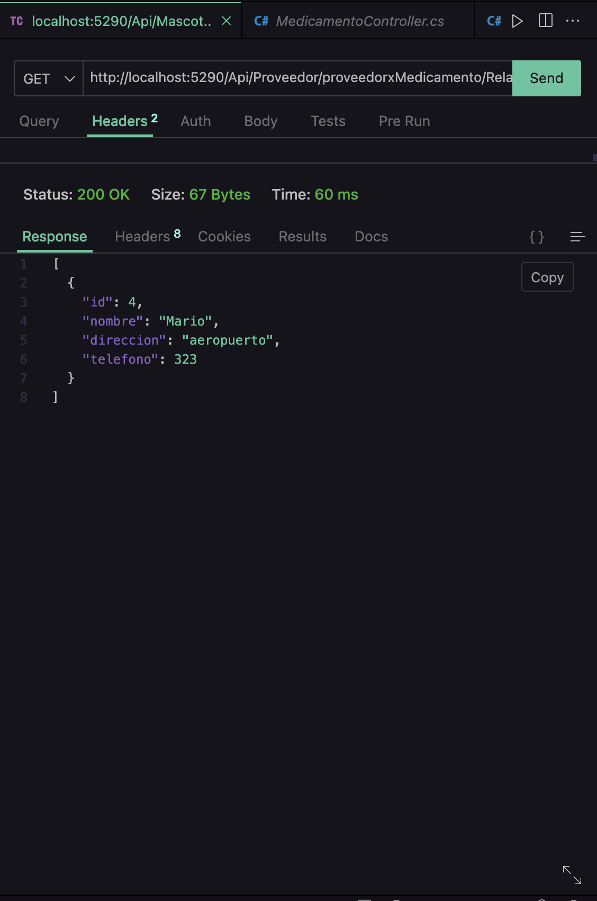

11. Mascotas y Propietarios de Raza Golden Retriever

URL: http://localhost:5290/Api/Mascota/mascotaPropietario

Descripción: Proporciona información de mascotas y propietarios de raza Golden Retriever.
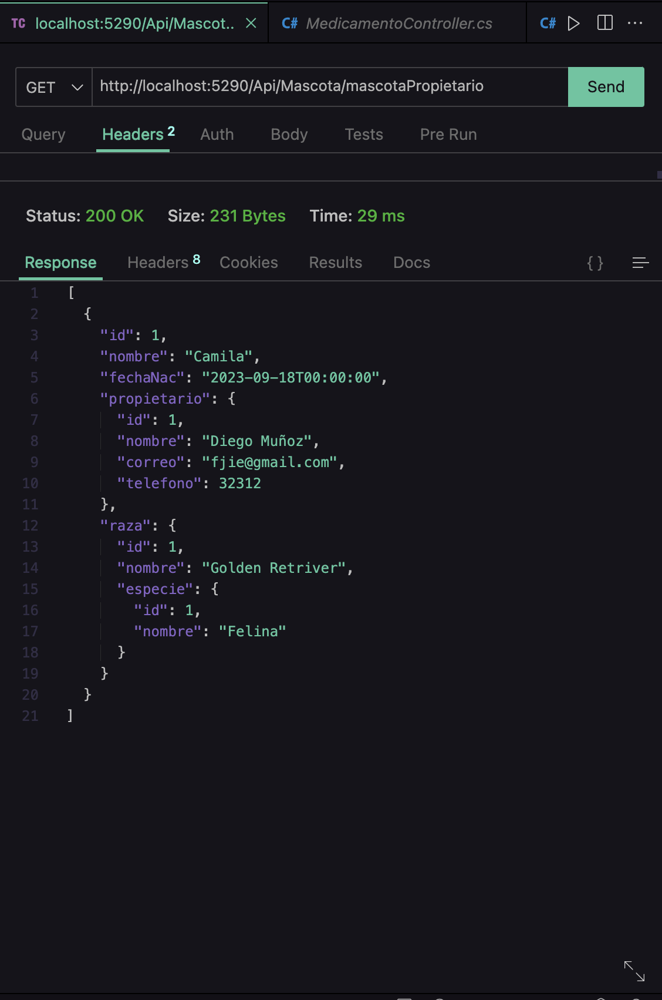

12. Cantidad de Mascotas por Raza

URL: http://localhost:5290/Api/Raza/mascotaxRaza

Descripción: Devuelve la cantidad de mascotas agrupadas por raza.
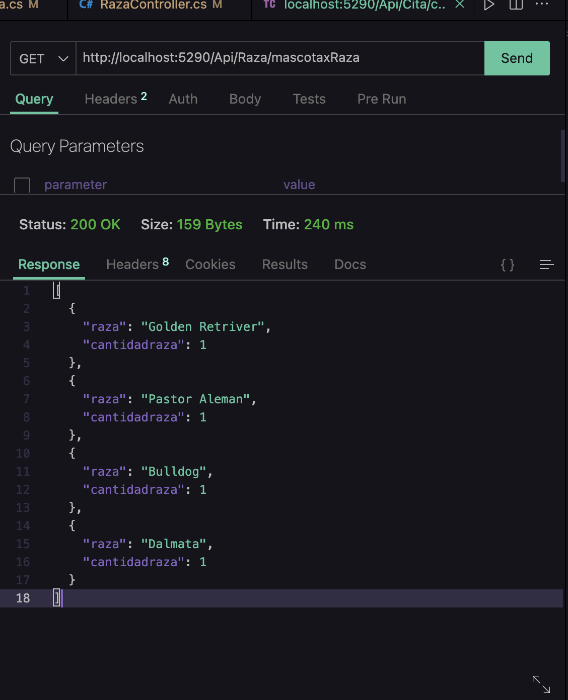

